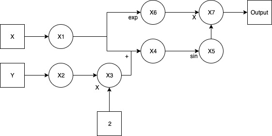
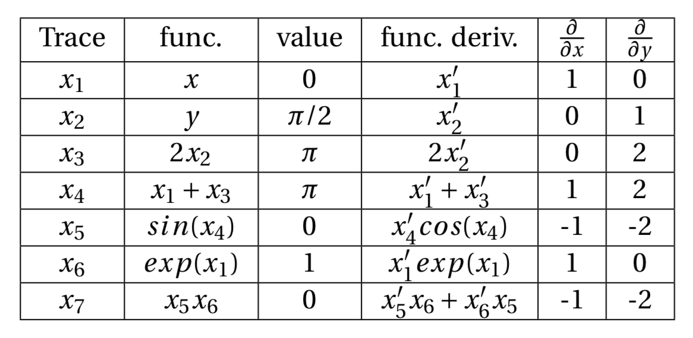

# Group 13 - Documentation

## Introduction

Our software aims to compute derivatives accurately and in a cost-efficient manner. We will create a Python package that implements the forward and reverse modes of automatic differentiation. This is important because it overcomes the limitations of symbolic differentiation (computationally intensive) and the finite difference method (accuracy/stability).

Derivatives are extremely important in numerical algebra. We can use derivatives to find the roots of differentiable functions or the minima of other functions. This second use case has become increasingly important in the field of machine learning where optimizing and "learning" in deep neural networks essentially boils down to finding local minima of highly nested function application.

## Background

Automatic differentiation (AD) breaks a function into a graph of elementary functions (ex: addition, multiplication, or log), and at each step, it calculates the value of both the function and its derivative.

Because the elemental functions are simple, we can calculate the derivative at each step to machine precision, thereby avoiding the stability issues with the numerical approach. Any elemental node simply uses the chain rule to determine its derivative, applying the derivatives from previous nodes along with the symbolic derivative of the elemental function. One should note that an elemental function's derivative is far simpler to define symbolically than that of the complete original function.

The decomposition of the original function into elemental functions is illustrated as a directed graph, with each node representing an elemental function and each edge carrying the results of one elemental function to be used as the inputs for another. As the graph is evaluated, the values are kept within a trace table, showing the function's value and derivative at each step of the AD process.

Once the process has traversed across the entire graph, the final node should have both the value and the derivative of the function at the given point of evaluation. These values will also be available in the final row of the trace table.

The forward mode of automatic differentiation actually computes the product of the Jacobian matrix, $J$, where the $i,j^{th}$ entry is $J_{i,j} = \frac{\partial(f_i)}{\partial(x_j)}$ for function $f_i$ and variable $x_j$, and a seed vector, $p$, which represents the initial derivatives of each variable. The implication of this fact is that if we have a function with two variables $x,y$ and we choose the seed vector $p=(1,0)$, then, the forward mode of automatic differentiation would output $\frac{\partial(f)}{\partial(x)$.

To illustrate the forward mode, let's consider the function
$$f(x,y) = e^xsin(x+2y)$$
where the inputs are $x$ and $y$. We would like to evaluate the function and find its derivative at $x=0$ and $y = \frac{\pi}{2}$. Additionally, we will seed the derivatives with $(1,1)$, which indicates that we would like to find derivatives of both $x$ and $y$. First, we can draw the computational graph of this function.



The trace table is shown below.



It is evident from the trace table that the final value of the function is 0, while the partial derivatives with respective to $x$ and $y$ are -1 and -2, respectively.

It is important to note that, the forward mode of automatic differentiation is more efficient when the number of outputs far exceeds the number of inputs. 

## How to Use `autodiffpy`

### Installation

You can install `autodiffpy` by running `pip` from the command line.

```bash
git clone https://github.com/free-holmes/cs207-FinalProject.git
cd cs207-FinalProject
pip install .
```

This will install a package called `autodiffpy` into Python. You can also create a virtual environment prior to installing with `pip`.

### Basic Usage

A user will most likely import two important exports from our package

```python
from autodiffpy import Var, Vector
```

The `Var` class can be used to instantiate abstract variables that can be differentiated later. For example, if we wanted to represent the function f(x) = x, we would write

```python
f = Var('x')
```

To create interesting functions, the user can just directly use the standard mathematical operations on our `Var` object. For example, if we wanted to represent the function f(x) = x^2 + 3x - x / 4, we would write

```python
x = Var('x')
f = x ** 2 + 3 * x - x / 4
```

If the user would like to use trignometric methods or log, they can import those objects from `autodiffpy`. For example, if we wanted to represent f(x) = cos(sin(2x)), we would write

```python
from autodiffpy import Sin, Cos, Var
f = Cos(Sin(2 * Var('x')))
```

The user can also have multiple variables. If our function was f(x, y) = x^(2y), we would write

```python
x = Var('x')
y = Var('y')
f = x ** (2 * y)
```

If the user would like to have a multidimensional output, they can combine multiple functions using the `Vector` class. Suppose our function was f(x, y) = (y^2, xy), we would write this as

```python
from autodiffpy import Var, Vector
x = Var('x')
y = Var('y')
f = Vector([y ** 2, x * y])
```

If the user would like to have a function which is a constant, they can do that as well with the `Const` export. Suppose we want f(x) = 1. That can be represented by

```python
from autodiffpy import Const
f = Const(1)
```

To get the value of a function at a particular point, the user can simply call the constructed function objects with keyword arguments. Note that the `x` and `y` in the keyword arguments are _not_ hardcoded; they correspond to the variables that are bound via `Var` constructors. For example,

```python
x = Var('x')
y = Var('y')
f = Vector([y ** 2, x * y])
f(x=1, y=2) # returns [4, 2]

z = Var('z')
f = z ** z
f(z=3) # returns 27
```

To get the derivative, the user can call `.derivative` on the `AutoDiff` object and pass in the variable to differentiate with respect to as well as the point they would like to get the derivative at. Again, the keyword arguments must correspond to the variables that are bound into the function.

```python
x = Var('x')
y = Var('y')
f = Vector([y ** 2, x * y])
f.derivative('x', x=1, y=2)
f.derivative('y', x=1, y=2)
```

The distinction between forward and backward mode will be hidden from the user and decided automatically depending on the number of inputs and outputs of the function.

### Quick Demo

Suppose we are interested in modeling the wacky function f(x) = x^x. We would create the function as thus:

```python
from autodiffpy import Var
f = Var('x') ** Var('x')
```

To evaluate this function at f(4), we would write

```python
f(4) # returns 256
```

and to get the derivative at the point, f'(4), we would write

```python
f.derivative('x', x=4) # returns approximately 610.89
```

## Software Organization

### Directory Structure

```
cs207-FinalProject/
    autodiffpy/
        __init__.py
        demo.py
        forward.py
        reverse.py
        test/
            test_demo.py
            test_forward.py
            test_reverse.py
    docs/
        documentation.md
        milestone1.md
        milestone2.md
        pics/
            milestone2-comp-graph.jpg
            milestone2-trace-table.png
    .gitignore
    .travis.yml
    LICENSE
    README.md
    setup.py
```

### Modules

The primary exported module is `autodiffpy` which lives in its entirety under the `autodiffpy` folder. This contains all the publicly accessible interfaces.

Under the `autodiffpy` folder is the `forward.py` file/module. This contains the logic and implementation of the forward mode of automatic differentiation. It defines the various "nodes" in our computation graph including the interesting elementary functions like Log and the trig functions.

### Tests

Tests live under the `autodiffpy/test` folder. They can be run from the top-level of the repository using the singular command `pytest`. Tests are run on every commit to the repository via `TravisCI`. Coverage information is generated via `pytest` directly by invoking with the `pytest --cov=autodiffpy`. Coverage information is stored via a call to `codecov` during the Travis build.

### Installation

A file named `setup.py` has been set up at the top-level of the repository. Installation is thus very simple. If you are within the repository, running

```bash
pip install .
```

will install `autodiffpy` into Python.

## Implementation

Our implementation is heavily inspired by dual numbers but does not actually use the word dual numbers although it is functionally equivalent.

We define a base class called `AutoDiff` in `forward.py` that implements all the dunder methods that are relevant for combining various objects together. The class leaves undefined the `__call__` and `derivative` methods since those are specific to the particular node within the computation graph. The implementation is succinct and included below:

```python
class AutoDiff:
    def __init__(self):
        pass

    def __call__(self, **kwargs):
        """Not implemented"""

    def derivative(self, *variables, **kwargs):
        """Not implemented"""

    @classmethod
    def _coerce(self, thing):
        if isinstance(thing, AutoDiff):
            return thing

        if isinstance(thing, (float, int)):
            return Constant(thing)

        if isinstance(thing, str):
            return Var(thing)

        raise ValueError

    def __add__(self, other):
        return Add(self, AutoDiff._coerce(other))

    def __radd__(self, other):
        return Add(AutoDiff._coerce(other), self)

    def __sub__(self, other):
        return Sub(self, AutoDiff._coerce(other))

    def __rsub__(self, other):
        return Sub(AutoDiff._coerce(other), self)

    def __mul__(self, other):
        return Mul(self, AutoDiff._coerce(other))

    def __rmul__(self, other):
        return Mul(AutoDiff._coerce(other), self)

    def __truediv__(self, other):
        return Div(self, AutoDiff._coerce(other))

    def __rtruediv__(self, other):
        return Div(AutoDiff._coerce(other), self)

    def __pow__(self, other):
        return Pow(self, AutoDiff._coerce(other))

    def __rpow__(self, other):
        return Pow(AutoDiff._coerce(other), self)
```

We define a `classmethod` called `_coerce` to help in situations where the dunder method is called with a float or integer such as

```python
f = 2 * Var('x')
```

so that the subexpressions are always themselves `AutoDiff` objects so that when we recurse on them during `.derivative` or `.__call__`, we don't get errors.

For the remainder of the functions, we simply inherit from this `AutoDiff` class and implement the `__call__` and `derivative` methods. We also initialize the relevant attributes of a node. For example, `Add` has a `left` and `right` attribute corresponding to the left and right nodes of the add. `Log` only has a `val` attribute since it only takes in one argument. As an example, here is the `Div` class:

```python
class Div(AutoDiff):
    def __init__(self, top, bottom):
        super().__init__()

        self.top = top
        self.bottom = bottom

    def __call__(self, **kwargs):
        return self.top(**kwargs) / self.bottom(**kwargs)

    def derivative(self, *args, **kwargs):
        g = self.bottom(**kwargs)
        return (
            self.top.derivative(*args, **kwargs) * g
            - self.top(**kwargs) * self.bottom.derivative(*args, **kwargs)
        ) / g ** 2
```

We see that the `.derivative` method follows exactly the same form as the epsilon coefficient in the `Dual` methods.

The `Constant` and `Var` classes serve as "base cases" for our recursive traversal of the computation graph. At the nodes of the graph, we can either return the constant given, zero, one, or substitute in the value of the variable provided by the user.

Another thing of note is that we completely generalized the derivative of powers so that there is no need for special casing for constant vs variable exponents. This is captured by the `Pow` class, which is implemented as:

```python
class Pow(AutoDiff):
    def __init__(self, base, exp):
        super().__init__()
        self.base = base
        self.exp = exp

    def __call__(self, **kwargs):
        return self.base(**kwargs) ** self.exp(**kwargs)

    def derivative(self, *args, **kwargs):
        a, b = self.base(**kwargs), self.base.derivative(*args, **kwargs)
        c, d = self.exp(**kwargs), self.exp.derivative(*args, **kwargs)
        return a ** c * (d * np.log(a) + b * c / a)
```

### External Dependencies

We only rely on `numpy` as our external dependency. We use `numpy` to compute the trigonometric functions and log. We also use `numpy` to return arrays when the result of an evaluation is a vector.

## Extension: Reverse Mode
We implemented automatic differentiation reverse mode as our extension.

|    |   | Supported | Functions |    |    | 
| ---- | ---- |----- | ---- |------ | ---- |
| exp  | ln   | log  | log2 | log10 | sqrt |
| sin  | cos  | tan  | sec  | csc   | cot  |
| sinh | cosh | tanh | sech | csch  | coth |

The `log` function defaults to natural log but has an optional parameter `base` that the user can specify.  
```python
# to specify 3 as the log base
log(x, 3)
```

### How to use  
Non-vector operations are almost identical to the forward mode. Primary difference is we now utilize a `Reverse` object instead of a `Var` object. In addition you must seed the function, typically with a value of `1`.

```python
from autodiffpy import Reverse, exp

x = Reverse(1)
y = Reverse(2)
func = x * y + exp(x*y)
func.gradient_value = 1.0 #this is the seed
print(func.value)
print(x.get_gradient())
print(y.get_gradient())

>>> 9.38905609893065
>>> 16.7781121978613
>>> 8.38905609893065
```

### Vector Operations  
```python
from autodiffpy import Reverse, rVector

func = ['x*2*y+y**3', '2*x**2*y', '3*y'] #pass in list of functions
vars_dict = {'x': 1, 'y': 2} #pass in dictionary of variables and values
vector = rVector(func, vars_dict)

print(vector)
>>> x=1
>>> y=2
>>> x*2*y+y**3=12.0  Df(x)=4.0  Df(y)=14.0
>>> 2*x**2*y=4.0  Df(x)=8.0  Df(y)=2.0
>>> 3*y=6.0  Df(x)=0  Df(y)=3

#calculate value and gradients for new variable values
vector.find_gradients(variables={'x': 5, 'y': 3})
print(vector)
>>> x=5
>>> y=3
>>> x*2*y+y**3=57.0  Df(x)=6.0  Df(y)=37.0
>>> 2*x**2*y=150.0  Df(x)=60.0  Df(y)=50.0
>>> 3*y=9.0  Df(x)=0  Df(y)=3

#get gradient of specific function and variable
vector.get_gradients(func_num=0, var_name='x')
>>> 6.0

#get gradient of one variable from all functions
vector.get_gradients(var_name='x')
>>> [6.0, 60.0, 0]

#get gradient of all variables from one function
vector.get_gradients(func_num=0)
>>> {'x': 6.0, 'y': 37.0}
```


### External Dependencies

We only rely on `numpy` as our external dependency. We use `numpy` to compute the trigonometric functions and log. We also use `numpy` to return arrays when the result of an evaluation is a vector.

### Not Implemented

We still have not implemented the reverse mode, which is our planned extension for future work. Also, we can continue to add tests to improve the robustness of our package (although line coverage is already 100%).

## Future Features

The main future feature we would like to implement is the reverse mode of automatic differentiation. The primary difficulty in implementing the reverse mode is mainly capturing the logic of the reverse mode with our computations. With the forward mode, it felt straightforward since the dual numbers provided much of the scaffolding. With the reverse mode, it feels much more open ended although still well-defined.

The main data structure that will have to change is our modeling of the computation graph. It is imperative in the reverse mode that we are able to visit the "parents" of a node in the graph to perform the computation, so we will need to add additional attributes to each node to include the "back edges" to its parents.

Most likely we will include the work for the reverse mode in `autodiffpy/reverse.py` and then refactor common components between `forward.py` and `reverse.py` into a file called `common.py` or similar. Also, note that it is ultimately our goal to automatically choose between forward and reverse mode based on the number of inputs and outputs to the defined function.
